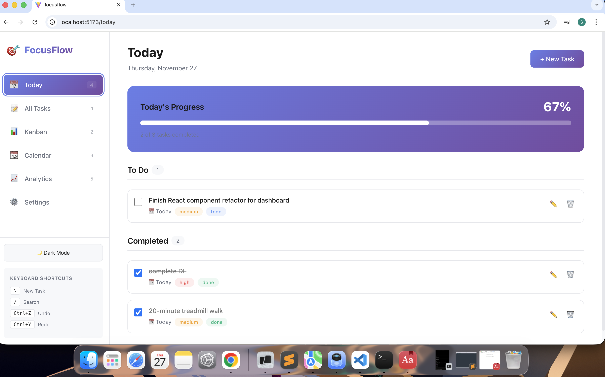

# 🎯 FocusFlow

**FocusFlow** is an advanced productivity To-Do application built with React, designed to help you stay focused and organized. It features multiple views, natural language task input, Pomodoro timer, analytics, and much more!
## today 

### List View


### Kanban Board


### Calendar View


### Analytics Dashboard


## ✨ Features

### Core Task Management
- ✅ **CRUD Operations** - Create, Read, Update, and Delete tasks
- 📝 **Rich Task Details** - Title, description, due date, priority, status, tags, and subtasks
- 🔄 **Recurring Tasks** - Set daily, weekly, or custom recurring tasks
- 🔍 **Search & Filter** - Powerful search and filtering by priority, status, and tags
- 🎯 **Drag & Drop** - Reorder tasks easily with drag-and-drop

### Multiple Views
- 📋 **List View** - Classic list view with drag-and-drop reordering
- 📊 **Kanban Board** - Organize tasks by status (Backlog, To Do, In Progress, Done)
- 📆 **Calendar View** - View tasks in a calendar format
- ⏰ **Today View** - Focus on tasks due today or overdue
- 📈 **Analytics Dashboard** - Charts and insights about your productivity

### Advanced Features
- 🍅 **Pomodoro Timer** - Built-in Pomodoro timer to boost focus
- 🧠 **Natural Language Input** - Create tasks quickly with natural language
  - Example: `"Submit report tomorrow at 5pm !high @work"`
- ⏮ **Undo/Redo** - Undo and redo task operations (Ctrl+Z / Ctrl+Y)
- 🌓 **Dark/Light Theme** - Toggle between dark and light themes
- ⌨️ **Keyboard Shortcuts** - Navigate and manage tasks with keyboard shortcuts
- 🔔 **Browser Notifications** - Get notified about tasks and Pomodoro sessions
- 💾 **Local Storage** - All data persists in localStorage
- 🎨 **Smooth Animations** - Beautiful animations with Framer Motion
- 📱 **Responsive Design** - Works seamlessly on desktop, tablet, and mobile

## 🚀 Getting Started

### Prerequisites
- Node.js (v14 or higher)
- npm or yarn

### Installation

1. **Clone the repository** (if using git) or navigate to the project directory:
   ```bash
   cd focusflow
   ```

2. **Install dependencies**:
   ```bash
   npm install
   ```

3. **Start the development server**:
   ```bash
   npm run dev
   ```

4. **Open your browser** and navigate to `http://localhost:5173`

### Building for Production

```bash
npm run build
```

The production-ready files will be in the `dist` directory.

### Preview Production Build

```bash
npm run preview
```

## 📖 Usage Guide

### Creating Tasks

#### Quick Add with Natural Language
Use the "Quick Add" field in the task form to create tasks with natural language:
- `"Buy groceries tomorrow !high"` - Creates a high-priority task due tomorrow
- `"Team meeting next week at 2pm @work"` - Creates a task tagged "work" due next week at 2pm
- `"Review PR today !medium @code"` - Creates a medium-priority task due today tagged "code"

**Natural Language Syntax:**
- `!high`, `!medium`, `!low` - Set priority
- `@tag` - Add tags (e.g., @work, @personal, @urgent)
- Date keywords: `today`, `tomorrow`, `next week`, `next month`
- Time: `at 5pm`, `at 17:00`

#### Manual Task Creation
Click "+ New Task" and fill in the form with:
- Title (required)
- Description
- Due date
- Priority (low, medium, high)
- Status (backlog, todo, in-progress, done)
- Tags
- Subtasks

### Navigating Views

Use the sidebar to switch between views:
- **Today** (Keyboard: `4`) - See tasks due today
- **All Tasks** (Keyboard: `1`) - List view of all tasks
- **Kanban** (Keyboard: `2`) - Board view grouped by status
- **Calendar** (Keyboard: `3`) - Calendar view of tasks
- **Analytics** (Keyboard: `5`) - View productivity statistics
- **Settings** - Configure app preferences

### Keyboard Shortcuts

| Shortcut | Action |
|----------|--------|
| `N` | Create new task |
| `/` | Focus search bar |
| `T` | Toggle theme (dark/light) |
| `Ctrl+Z` | Undo last action |
| `Ctrl+Y` | Redo action |
| `1` | Go to All Tasks view |
| `2` | Go to Kanban view |
| `3` | Go to Calendar view |
| `4` | Go to Today view |
| `5` | Go to Analytics view |

### Using the Pomodoro Timer

1. Navigate to **Settings**
2. Configure Pomodoro durations (default: 25/5/15 minutes)
3. Start the timer to focus on a task
4. Take breaks when prompted
5. Track your focus sessions

### Customizing Settings

In the Settings view, you can:
- Switch between light and dark themes
- Enable/disable browser notifications
- Toggle sound effects
- Adjust Pomodoro timer durations
- View app information

## 🏗️ Project Structure

```
focusflow/
├── src/
│   ├── components/
│   │   ├── common/           # Reusable components
│   │   │   ├── Badge.jsx
│   │   │   ├── Button.jsx
│   │   │   ├── Card.jsx
│   │   │   ├── Input.jsx
│   │   │   └── Modal.jsx
│   │   ├── layout/           # Layout components
│   │   │   ├── Header.jsx
│   │   │   ├── Layout.jsx
│   │   │   └── Sidebar.jsx
│   │   ├── pomodoro/         # Pomodoro timer
│   │   │   └── PomodoroTimer.jsx
│   │   └── tasks/            # Task components
│   │       ├── TaskFilters.jsx
│   │       ├── TaskForm.jsx
│   │       └── TaskItem.jsx
│   ├── hooks/                # Custom hooks
│   │   ├── useKeyboard.js
│   │   ├── useNotification.js
│   │   └── useTheme.js
│   ├── store/                # Zustand state management
│   │   └── useStore.js
│   ├── utils/                # Utility functions
│   │   ├── constants.js
│   │   ├── dateUtils.js
│   │   ├── naturalLanguageParser.js
│   │   └── notificationUtils.js
│   ├── views/                # Main view components
│   │   ├── AnalyticsView.jsx
│   │   ├── CalendarView.jsx
│   │   ├── KanbanView.jsx
│   │   ├── ListView.jsx
│   │   ├── SettingsView.jsx
│   │   └── TodayView.jsx
│   ├── App.jsx               # Main app component
│   ├── App.css               # App styles
│   ├── index.css             # Global styles
│   └── main.jsx              # Entry point
├── public/
├── package.json
└── README.md
```

## 🛠️ Tech Stack

- **Framework**: React 18
- **Build Tool**: Vite
- **State Management**: Zustand
- **Routing**: React Router DOM
- **Drag & Drop**: @hello-pangea/dnd
- **Calendar**: react-calendar
- **Charts**: Chart.js + react-chartjs-2
- **Animations**: Framer Motion
- **Date Handling**: date-fns
- **Unique IDs**: uuid
- **Styling**: Pure CSS with CSS Variables


## 🎨 Customization

### Changing Theme Colors

Edit the CSS variables in `src/index.css`:

```css
:root {
  --bg-primary: #ffffff;
  --bg-secondary: #f7f8fa;
  --text-primary: #1a1a1a;
  /* ... more variables */
}
```

### Adding New Views

1. Create a new component in `src/views/`
2. Add a route in `src/App.jsx`
3. Add a navigation item in `src/components/layout/Sidebar.jsx`

## 🤝 Contributing

Contributions are welcome! Feel free to:
- Report bugs
- Suggest new features
- Submit pull requests


## 🙏 Acknowledgments

- Icons: Emoji icons for simplicity
- Design inspiration: Notion, Todoist, and modern productivity apps
- Built with modern React best practices

**Made with ❤️ using React + Vite**

Enjoy staying productive with FocusFlow! 🎯✨
